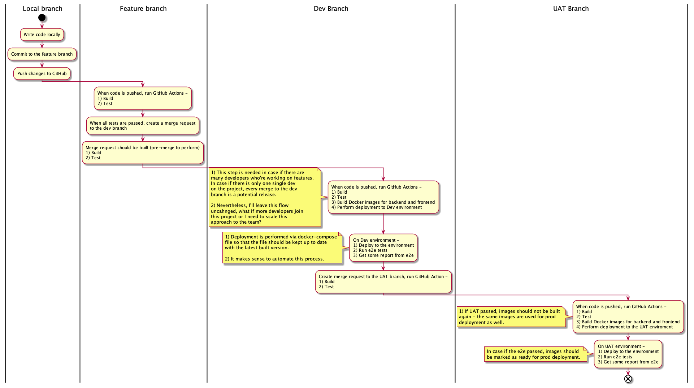

# Release process definition

The main goal is to have CI/CD process which works. I suppose, GitLab flow is a good way of dealing with branches and releases here. The following environments are required: 

* `dev` for regular development. 
* `uat` to perform UAT. 
* `prod` is the most stable branch which is ready to be deployed to production. 

Because the application is going to be developed and deployed in-house, main artifacts are Docker images. I want Docker images from `uat` to `prod` environments to go unchanged (immutable artifacts), code and artifacts which are tested on `uat` go to `prod` unchanged. It leads to the following: 

* `main` branch stores the code which next will be deployed to `uat` for testing and after that to `prod`. 
* `dev` branch is the main development branch.
* feature-branches are useful but optional (because I'm the single developer here).

Another outcome is that it's necessary to tag Docker images when they're: 

* built
* version passes tests

## Overall process: 

In this particular case (only one developer), it is assumed that every merge of a feature branch to the `dev` branch is an end of development and release is ready to be performed. So that, there will be a simplification - no `dev` branch, only feature branches and `main`. Again, it is because there is only one single developer. 

Based on it, the following pipelines are needed: 

* `on merge-request` pipeline which runs `build` and `test` phases, no Docker images, just CI part. 
* `on merge to main` pipeline which not only runs `build` and `test` but also build Docker images and update `docker-compose.yml` files for the `uat` environment. As soon as this pipeline finishes, it is necessary to deploy the code to the `uat` environment and perform `e2e` testing. 
* `on release` pipeline should tag docker images built on the previous step as production-ready. 

## Additional considerations

Because of using in-house computers, I can't start (actually, can, for example, by using `ngrok`) CD part automatically. Nevertheless, I assume, it's possible to prepare everything for it. 

* deployment to be performed using `docker-compose.yml` files. 
* different environments should use their own database instances. 
* environment name should not be hardcoded, it should be possible to change it using environment variable. 

## Pipeline Content

### On Merge Request

Trigger: merge request
Steps: 

* `build`
* `test`

### On Merge to the `main` branch

Trigger: code is merged to the `main` branch
Steps: 

* `build`
* `test`
* Build Docker images, tag them with the value from `package.json` file.
* Update `docker-compose.yml` file for the `uat` environment. 

## On Release

Trigger: manual
Steps: 

* Remove `-SNAPSHOT` part of the version (`1.0.0-SNAPSHOT` -> `1.0.0`). 
* Tag images built on the previous step.
* Tag code in git. 
* Start a new development version, update `package.json` files (`1.1.0-SNAPSHOT`).

## Versioning Strategy

When the version is in development is should have a `-SNAPSHOT` suffix at the end. For example, `1.0.0-SNAPSHOT`. When code is merged into the `main` branch, image names should build their names using the following strategy: component + version, example, `frontend-1.0.0-SNAPSHOT`. 

When an `on-release` pipeline is performed, a new development version should be started. 